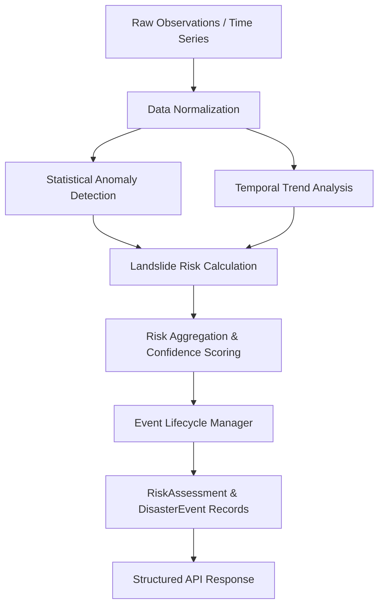

# System Architecture: Disaster Intelligence Engine (SIH26001)

## 1. Overview & Purpose

The **Disaster Intelligence Engine** is the core analytical processing subsystem of the **AI-Based Early Warning and Landslide Risk Monitoring System in the North Eastern Region (NER)** (SIH26001).

The engine is **not** a weather chatbot and **not** an LLM guessing risk. It is an independent, deterministic, scientific/rule-based intelligence pipeline that continuously ingests environmental, meteorological, and terrain data, detects statistical anomalies, analyzes temporal trends, computes explainable landslide risk scores, manages disaster event lifecycles, and exposes structured intelligence to downstream expert interfaces and API consumers.

---

## 2. High-Level Architecture Diagram

```text
                               DATA SOURCES
                     (Simulated / AWS / Terrain Sensors)
                                    |
                                    v
                     +------------------------------+
                     |    Data Ingestion Layer      |
                     |  (DataSource Abstraction)    |
                     +--------------+---------------+
                                    |
                                    v
                     +------------------------------+
                     |      Data Normalization      |
                     |    & Observation Storage     |
                     +--------------+---------------+
                                    |
                                    v
          +----------------------------------------------------+
          |           DISASTER INTELLIGENCE ENGINE             |
          |                                                    |
          |  +---------------------+  +---------------------+  |
          |  |  Anomaly Detector   |  |   Trend Analyzer    |  |
          |  |  (Rolling Z-Scores) |  | (Linear Derivatives)|  |
          |  +----------+----------+  +----------+----------+  |
          |             |                        |             |
          |             +-----------+------------+             |
          |                         |                          |
          |                         v                          |
          |            +-------------------------+             |
          |            |  LandslideRiskAnalyzer  |             |
          |            |   (Explainable Weights) |             |
          |            +------------+------------+             |
          |                         |                          |
          |                         v                          |
          |            +-------------------------+             |
          |            |     Risk Aggregator     |             |
          |            +------------+------------+             |
          |                         |                          |
          |                         v                          |
          |            +-------------------------+             |
          |            |      EventManager       |             |
          |            |    (State Machine)      |             |
          |            +-------------------------+             |
          +-------------------------+--------------------------+
                                    |
                                    v
                     +------------------------------+
                     |  Disaster Events & Risk State |
                     |     (Persistent Storage)     |
                     +--------------+---------------+
                                    |
                    +---------------+---------------+
                    |                               |
                    v                               v
         +--------------------+          +--------------------+
         |   FastAPI Layer    |          | Future AI Agents & |
         |   REST Endpoints   |          |  Field Team Alerts |
         +---------+----------+          +--------------------+
                   |
                   v
         +--------------------+
         | Verification UI /  |
         | Expert Interfaces  |
         +--------------------+
```

---

## 3. Engine Pipeline Flow

When the engine executes (via scheduled background worker or on-demand via `POST /api/v1/engine/run`), it processes each monitored location through six sequential stages:



### Stage 1: Ingestion & Normalization
- Ingests chronological observation vectors (`rainfall_1h`, `rainfall_6h`, `rainfall_24h`, `soil_moisture`, `pressure`, `temperature`, `wind_speed`).
- Fills or flags missing indicators and validates realistic boundaries.

### Stage 2: Statistical Anomaly Detection (`AnomalyDetector`)
- Calculates rolling baseline statistics (mean $\mu$, sample variance $s^2$, and standard deviation $\sigma$).
- Determines z-score metric departures:
  $$z = \frac{x_{\text{current}} - \mu}{\sigma}$$
- Safely handles zero/near-zero variance baseline states (e.g. prolonged dry spells followed by sudden heavy rain).
- Outputs structured `AnomalyResult` flags.

### Stage 3: Temporal Trend Analysis (`TrendAnalyzer`)
- Calculates rate-of-change linear regression slopes over rolling hourly time windows:
  $$\text{slope} = \frac{\sum (t_i - \bar{t})(y_i - \bar{y})}{\sum (t_i - \bar{t})^2}$$
- Classifies trends into `INCREASING`, `DECREASING`, `STABLE`, or `UNKNOWN`.
- Distinguishes **isolated rainfall bursts** from **heavy + persistent + increasing precipitation** (continuous precipitation across $>50\%$ of time windows or accumulated $>120\text{mm}$).

### Stage 4: Explainable Landslide Risk Model (`LandslideRiskAnalyzer`)
- Uses configurable weights stored in configuration:
  $$\text{Risk Score} = \sum_{k} \frac{w_k \cdot S_k}{\sum w_k}$$
  Where factors $k$ include:
  1. Rainfall Intensity (1h and 6h rates)
  2. Rainfall Anomaly (24h departure z-score)
  3. Rainfall Persistence & Compounding Trend
  4. Soil Moisture Volumetric Saturation %
  5. Soil Saturation Rate (Slope derivative)
  6. Terrain Slope Angle & Elevation Factor
  7. Historical Geological Susceptibility Index
- Maps normalized score ($0-100$) to operational risk tiers:
  - `0 - 24`: **LOW**
  - `25 - 49`: **MODERATE**
  - `50 - 74`: **HIGH**
  - `75 - 100`: **CRITICAL**
- Emits transparent factor contributions explaining the exact mathematical influence of each indicator.

### Stage 5: Disaster Event State Machine (`EventManager`)
- Prevents duplicate event alerts for ongoing hazards.
- Manages state transitions:
  ```text
  NORMAL (Score < 25)
     │
     ▼ (Score >= 25)
   WATCH
     │
     ▼ (Score >= 40)
  ELEVATED
     │
     ▼ (Score >= 50)
  HIGH RISK
     │
     ▼ (Score >= 75)
  CRITICAL
     │
     ▼ (Score < 25)
  RESOLVED
  ```
- Automatically handles risk escalation, de-escalation, and resolution.

---

## 4. Separation of Concerns

1. **Deterministic Processing**: No stochastic or LLM hallucinations in the risk calculation pathway.
2. **Modular Components**: Each analyzer (`AnomalyDetector`, `TrendAnalyzer`, `LandslideRiskAnalyzer`, `EventManager`) is isolated, testable, and independently upgradeable (ready to plug in ML models later).
3. **Transparent Traceability**: Every score generated is accompanied by contributing factors and baseline departure metrics.
